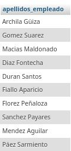
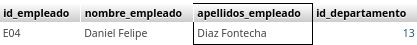
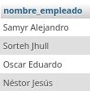
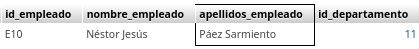
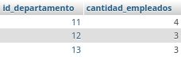
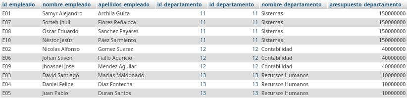
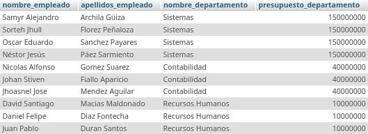
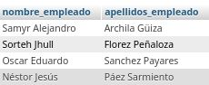

# consultas2_sql

## Modelo Físico de la Base de Datos

---

## Creación de la Base de Datos

1. Empleados De la Empresa

2. Tabla de el Departamento

## Consultas de la base de datos.

1. Obtener la lista de los apellidos de todos los empleados.

`SELECT apellidos_empleado FROM Empleado;`

2. Obtener los apellidos de todos los empleados sin repeticiones.

`SELECT DISTINCT apellidos_empleado FROM Empleado;`

3. Obtener todos los datos de los empleados que se apellidan 'Gomez'.

`SELECT * FROM Empleado WHERE apellidos_empleado LIKE 'Gomez%';`

4. Obtener todos los datos de los empleados que se apellidan "Diaz" y los que se apellidan "Rodriguez".  Usar OR o IN

`SELECT * FROM Empleado WHERE apellidos_empleado LIKE 'Diaz%' OR apellidos_empleado LIKE 'Rodriguez%';`

5. Obtener los nombres de los empleados que trabajan en el departamento 11

`SELECT nombre_empleado FROM Empleado WHERE id_departamento = 11;`

6. Obtener todos los datos de los empleados cuyo apellido empiece por 'P'

`SELECT * FROM Empleado WHERE apellidos_empleado LIKE 'P%';`

7. Obtener el presupuesto total de todos los departamentos.

`SELECT SUM(presupuesto_departamento) AS total_presupuesto FROM Departamento;`

8. Obtener el número de empleados de cada departamento.

`SELECT id_departamento, COUNT(id_empleado) FROM Empleado GROUP BY id_departamento;`

9. Obtener un listado completo de empleados, incluyendo por cada empleado los datos del empleado y de su departamento.

`SELECT * FROM Empleado, Departamento WHERE Empleado.id_departamento = Departamento.id_departamento;`

10. Obtener un listado completo de empleados, incluyendo el nombre y apellidos del empleado junto al nombre y presupuesto de su departamento.

`SELECT nombre_empleado,apellidos_empleado,nombre_departamento, presupuesto_departamento FROM Empleado, Departamento WHERE Empleado.id_departamento = Departamento.id_departamento;`

11. Obtener los nombres y apellidos de los empleados que trabajen en departamentos cuyo presupuesto sea mayor a 100000000

`SELECT nombre_empleado, apellidos_empleado FROM Empleado, Departamento WHERE Empleado id_departamento = Departamento id_departamento AND presupuesto_departamento > 100000000;`

